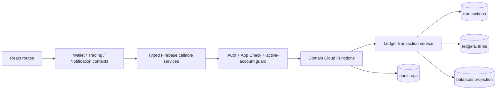
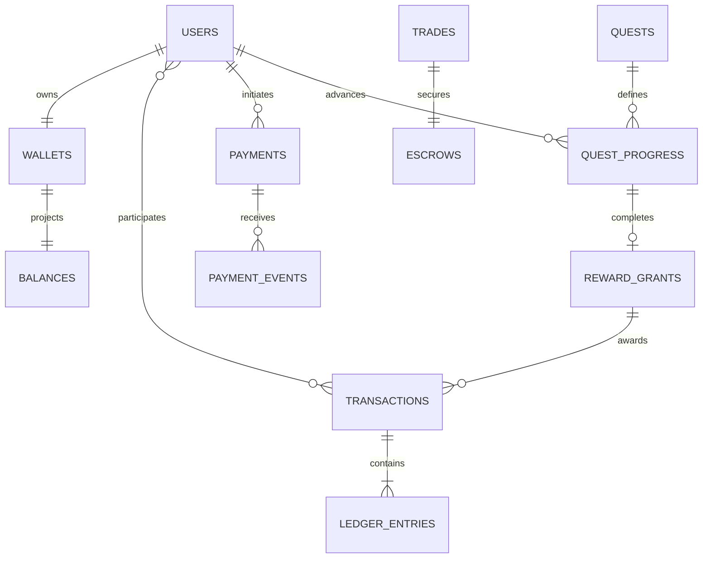
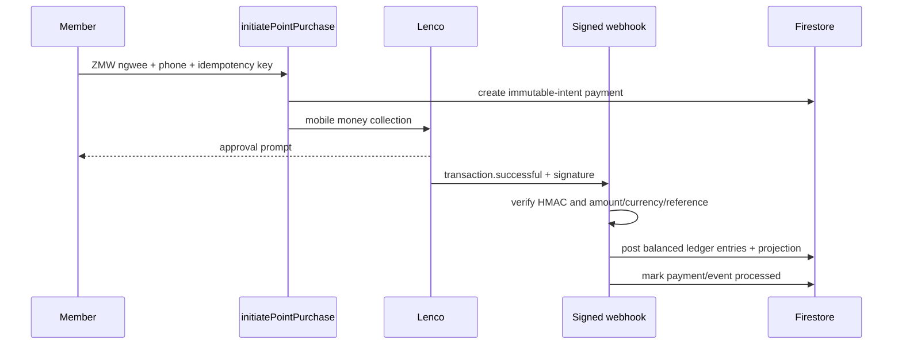
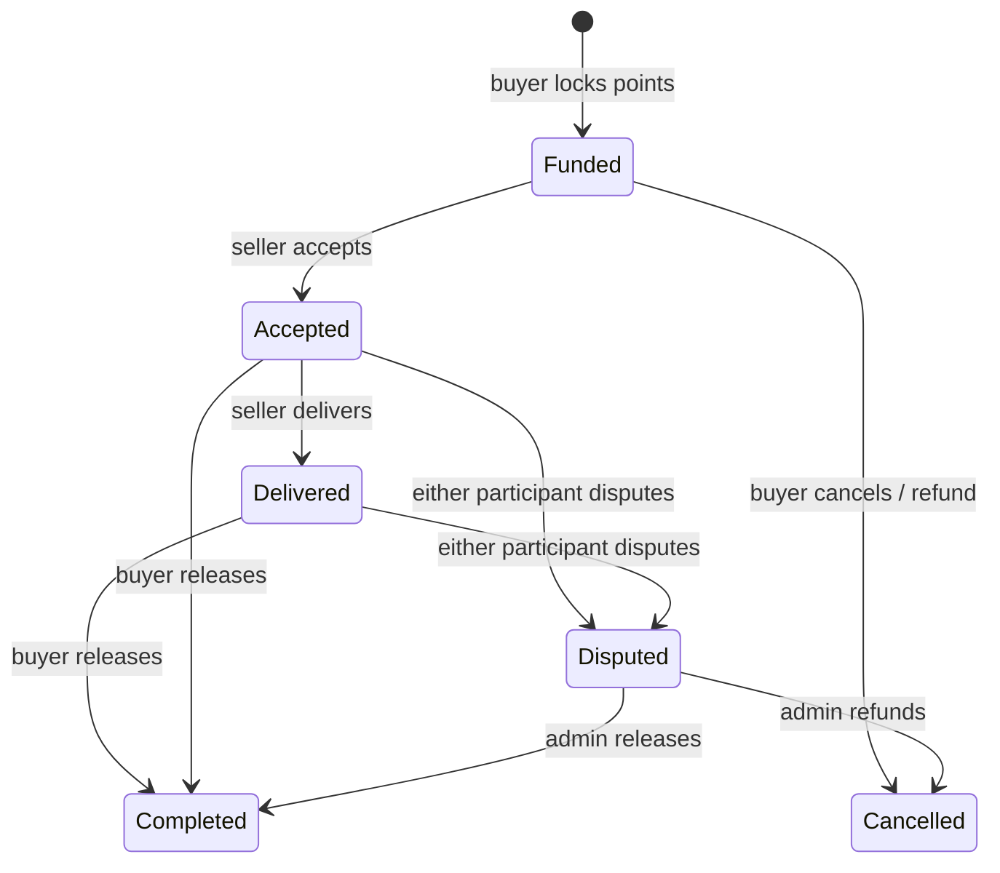
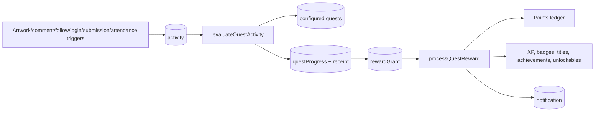

# Economy architecture

## Components

The React providers cache only display state. They never calculate or persist balances. Every value-moving request terminates at the shared ledger service, which checks integer values, balanced entries, non-negative member compartments, idempotency collisions and linked-record preconditions in one Firestore transaction.

## Collections

Large or append-only data is separated from user documents. `transactions`, `ledgerEntries`, provider events and audit records are immutable to clients and never deleted. System balances use 16 deterministic shards for fees, rewards and purchases to distribute contention.

## Point purchase sequence

The member status callable and scheduled 15-minute reconciler query Lenco as recovery paths. All three paths use the same deterministic ledger transaction ID, so only one can credit points.

## Trading sequence

The lock, release, fee and refund are double-entry ledger movements. State preconditions and state writes are included in the same Firestore transaction as settlement, preventing cancel/complete races.

## Quest sequence

Quest definitions provide `eventTypes`, optional metadata criteria, target, cadence, schedule, approval mode and an extensible rewards array. Activity receipts make each source event count once. Reward grants isolate retries from progress evaluation.

## Security boundaries

- Custom claims—not `users.role`—authorize admin and curator operations.
- Firestore rules prohibit client writes to all economy authority collections.
- Profile owners cannot edit role, account status, XP, quest completion or rewards.
- Admin mutations are callable-only and append an audit record.
- Lenco signatures use constant-time comparison; payload and provider IDs are retained for replay detection.
- All monetary values use integers (ngwee or points); balances never use floats.
- App Check is mandatory unless explicitly disabled for local emulator work.

## Operational monitoring

Scheduled functions reconcile 50 wallets per run, retry pending provider payments, and calculate daily volume, fee, revenue and quest metrics. Large transfers and large manual adjustments create reviewable `fraudAlerts`. Reconciliation discrepancies create `reconciliationIssues`; they are never silently overwritten.
